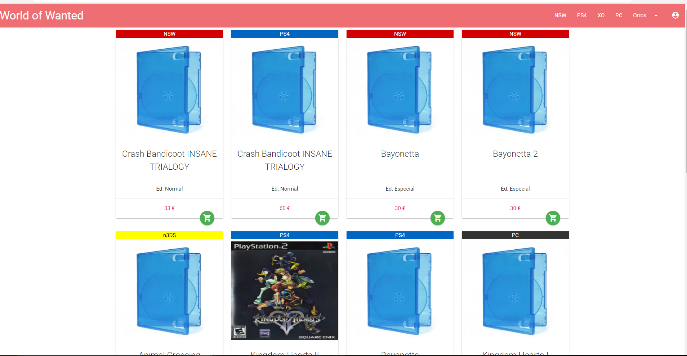

# Roaload
### Proyecto de PHP - MYSQL
# Tienda Online SPA
---------------------------

### Tecnologias utilizadas:
* Jquery
* parsley.js (Para validaciones)
* PHP
* Mysql - mysqli
* Materializecss (Framework CSS)
* API Telegram con bot
* Ajax (Para crear una aplicación SPA)
* Bootstrap

## Detalles de la APP

Es una tienda en la cual puedes ver productos sin tener que iniciar sesión, le administrador puede crear nuevos productos.
Faltan aun añadirle funcionalidad de comprar productos.

## Detalles sobre la API

Para poder comprobar que se mandan los datos correctamente(Más adelante se explica el funcionamiento),
deberás unirte a este  grupo de telegram [Este link](https://t.me/joinchat/AAAAAEVY1AOMUGzFyMhsuw)
- La API mas adelante se utilizará para avisar a los usuarios de sus pedidos(con permiso de los usuarios por las políticas de Telegram)
- Y para servicios técnicos y dudas

# Todo lo que puede ver un usuario no registrado
## Principalmente esta web destaca por solo terner una carga incial y no volver a recargar más. Podeis fijaros en la ruta que no cambia.

## Tenemos la pantalla de incio o index, que es común tanto para usuarios regitrados o no:

## Tenemos un mensaje que te advierte de las cookie si aceptamos desaparece y no volverá a aparecer hasta que borremos las cookies y si cancelamos seremos redireccionados a marvel.

## Footer

## Una cosa importante a tener encuenta es el "BreadCrum" que nos ayudará a navegar

## Info producto
* Ver información sobre un juego! Pinchando en cualquier foto de un producto:

## Podemos usar los puntos de menos para entrar mejor los juegos:

* Tendremos un páginado en la pagina que nos ayudará a cargar la información visualmente más bonita

## Filtrar Por el Buscador
* Si no tienes ganas de buscar por consola puedes buscar directamente en el buscador de la web
* Si hay resultados te lo mostrará y sino te avisará que no encontro!
* Mínimo tienes que buscar por 3 letras

## Pestaña de error cuando no encuentra nada:

## Inicio de sesión

* Pinchamos en ->

* Si no hemos inciado sesión, te pedirá iniciar sesión:

* Una vez iniciada sesión, nos aparecerá el perfil:

# Apartir de aquí es todo el contenido que puede ver un usuario registrado
Donde tendrémos muchas funciones.

# COMPRAR
## Añadir un producto a la cesta
* Si no tienes tienes productos en la cesta saldrá un mensaje de error, diciendote que esta vacia
* Hay 3 tipos de productos:
    * Con stock el cual saldrá su botón de comprar y se podra comprar
    * Sin stock osea ¡Agotado!
    * Descatalogado, este solo lo puede ver un administrador en la pestaña de administración(más adelante lo veremos)

* Al añadir un producto, nos saldrá un mensaje y en la cesta se añadirá nuestro producto
Por ejemplo añadiremos Splatoon 2:
El formato con el que salen es: "Producto" x "Cantidad"

* Una vez añadidos productos a la cesta podemos ver la cesta y realizar un pedido!

## Realizar un pedido
* Rellenamos los datos del pedido:

* Datos de entrega:

* Servicio de correo(Actualmente solo dispone de correos):

* Métodos de pago(Actualmente solo dispone transferencia bancaria):
    * La base de datos esta preparada solo faltaría valdiación de datos.

## Resumen del pedido
* Una vez terminado nos enviará al resumen del pedido
    * Localizador del pedido para poder realizar consultas con la atención al cliente
    * Tenemos la información del cliente
    * Información del dato de pago
    * Resumen del pedido

## Podemos ver la información del pedido en nuestro perfil

* Hay 4 estados de los pedidos:
    * 1 - Pendiente: Que se ha encargado pero aun no ha sido pagado(En este paso podemos cancelarlo sin problemas)
    * 2 - Pagado: Ha sido recibido el dinero pero aun no ha sido enviado
    * 3 - Recibido: Este lo establece el cliente cuando recibe el pedido
    * 4 - Cancelado: Por diversos motivos, ya sea por el cliente o el administrador

* Pedidos pendientes son los que aun no han sido finalizados
    * Estos muestra una lista los que aun estan pediente de pago o de envio
    * Los de estado pendiente pueden ser cancelados libremente

* Si intentas cancelar un pedido en estado "pagado"
    * Te pedira contactar con un administrador ya sea correo o administración
    * Actualmente el mensaje es un + "mensaje al soporte tecnico"

* Si cancelamos uno pendiente desaparecerá de la lista y aparecerá en la de histórico

* El resumen de pedido es igual pero con un boton que nos permitira avanzar el pedido a completado

* En la pestaña de Historial del pedido tenemos
    * Todos los pedidos relizados para poder ver su resumen
    * También deja cancelar los pendientes

## Soporte técnico

# Apartir de aquí es todo lo que puede ver un usuario Administrador.

## Todo lo que veremos ahora es apartir de entrar como administrador: admin admin

## El menú es diferente y tiene un opción que te manda a la consola de administración

## Esta consola tiene varias opciones

* En el menú desplegable encontramos:
    * Productos: Administrar productos
    * Clientes: Administrar clientes
* Menú superior:
    * Documentación
    * Volver a la tienda
* Análisis sobre la web:
    * Ganancias totales de todas las ventas: (Se calcula apartir de el precio de venta de todos los productos vendidos)
    * VENTAS totales: El número de productos que se han vendido
* Resumen de los últimos pedidos
* Social: número de usuarios que hay registrados

## Administración de productos:

* Tenemos 4 opciones(Se entiende mejor viendo el E/R):
    * Versiones: Aquí se administran los productos (Ver más abajo)
    * Juegos: Aquí se administran los juegos, creando juegos nuevo.
        * Tenemos la lista de juegos y el botón de añadir

        * Crear un nuevo juego despliega un nuevo modal para rellenar

        * Se validan con Parsley.js una libreria de validación

        * El juego se añade a la lista

    * Plataforma: Se crean igual que en Juego
    * Ediciones: Se crea un nuevo producto igual que en Juego

## Para versiones:
* Opcion de filtrar para buscar un producto que administrar
* Opcion de crear nueva version(En este caso crearemos una de spiderman para seguir el ejemplo)
* Listado de producto
* Editar version
* Deshabilitar una version: las versiones deshabilitada no apareceran en la web

* Filtro:

* Crear una versión:

## API telegram
* Aquí entra en juego nuestra api de telegram
    * Mandandonos un mensaje atravez del bot en nuestro canal de telegram

* Juego en la tienda:

* Deshabilitar:
    * Si deshabilitamos una versión automaticamente no aparecera en la web.

## Administrar usuarios

* Usuarios, podemos bloquearlos:

* Pedidos: Podemos ver los pedidos y administrarlos

* Mensajes: Ver los reportes de los clientes

# FIN de la Aplicación!
-------------------------

------------------------
# ANTIGUOS DETALLES / EVOLUCION DE LA APP

# Capturas de la APP
Aquí enseñaremos parte de la aplicacion explicada (El diseño CSS puede ser diferente al original)

* E/R BBDD

* Index

Vista general de la primera página de la web puede ser accedida por cualquier persona.

* Login

Para iniciar sesión a la derecha del navbar redirecciona a iniciarSesion.php si no estas conectado.
Todos los datos de la sesión se guardan en sesiones.

Login Error

* Registrarse

Para registrarnos en el login tenemos la opción Registrarse, cuando te registre te pide iniciar sesión.
Las contraseñas estan cifradas y comprueba si hay usuarios con ese nombre.

Registro Error

* Perfil en el index

Nuestro perfil y opciones a funcionalidades estan en un sidenav al lado derecho con un desplegable.
Actualmente no tiene ninguna funcionalidad de cesta en el usuario simple (Algunos usuarios tienen cestas de prueba).

El perfil del administrador solo sale si eres administrador de la web, el perfil cual añade el a la administración de la web.

* Apartado de administración de productos

Podemos crear tanto como productos los cuales se llaman "Versiones", plataformas nuevas, ediciones y información sobre un juego.
Aun no esta disponible la administración de pedidos.

* Versiones

Esta parte es la cual donde se crean los productos que se muestran en la página principal
Lista las Versiones existentes - Con filtros

En esta sección tenemos para crear una nueva en la cual entera en acción la Api de Telegram

El mensaje que manda a Telegram es el cual con esos datos.
El formato del mensaje sera modificado cuando se añadan fotos y más información de los productos.

Sale un mensaje de confirmación como en los anteriores.
A la hora de modificar se modiffca en un formulario y se añade a la misma columna.
A la hora de eliminar se borra de la columna.

* Ediciones / Plataformas / Juego

(Estas pestañas son muy parecidas y solo pondré una sección)
En la cual sale listado de las ediciones disponibles y puedes crear nuevas.

Crear edición / Formulario de nueva edición.

Ya existe una edición.

Edición creada.

